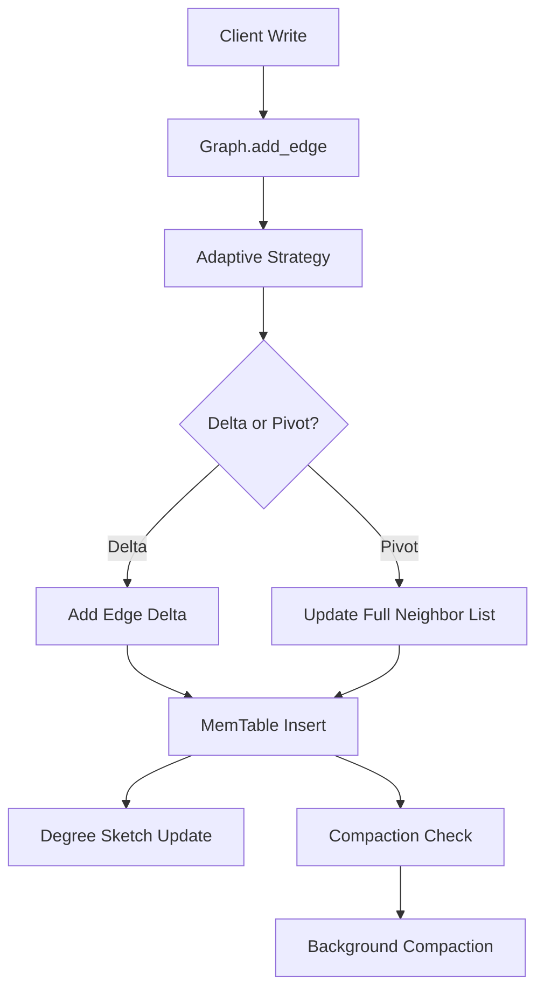
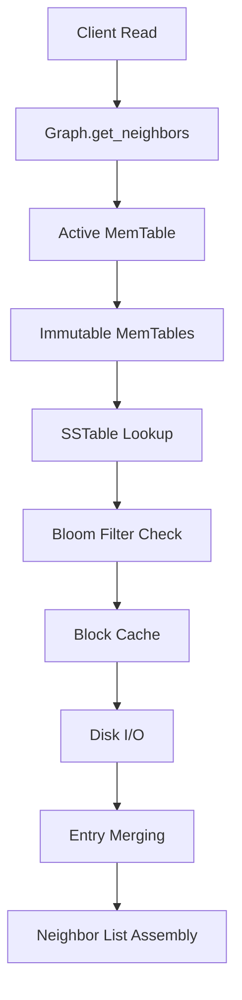

# Aster Architecture Guide

This document provides a comprehensive overview of Aster's system architecture, design decisions, and implementation details.

## System Overview

Aster is designed as a multi-layered graph database system that combines research-based optimizations with production-ready engineering practices.

## Layer Architecture

### 1. Client Interface Layer

**Location**: `src/lib.rs`, `src/query/`

The top layer provides multiple interfaces for database interaction:

```rust
pub struct AsterDB {
    storage: Arc<PolyLSM>,
    transaction_manager: Arc<TransactionManager>,
    query_engine: Arc<QueryEngine>,
    metrics_collector: Arc<MetricsCollector>,
    recovery_manager: Option<Arc<RecoveryManager>>,
}
```

**Key Components**:

- **AsterDB**: Main database handle with connection management
- **Query Engine**: Gremlin query processing and optimization
- **Transaction Manager**: MVCC transaction coordination
- **Metrics Collector**: Performance monitoring and statistics

### 2. Graph Abstraction Layer

**Location**: `src/graph/`

Provides high-level graph operations built on the storage layer:

```rust
pub struct Graph<'a> {
    storage: &'a Arc<PolyLSM>,
}

impl<'a> Graph<'a> {
    pub async fn add_vertex(&self, vertex_id: VertexId, properties: Option<Properties>) -> Result<()>
    pub async fn add_edge(&self, source: VertexId, target: VertexId, properties: Option<Properties>) -> Result<()>
    pub async fn delete_edge(&self, source: VertexId, target: VertexId) -> Result<()>  // Paper-compliant deletion markers
    pub async fn get_neighbors(&self, vertex_id: VertexId) -> Result<Vec<VertexId>>
}
```

**Features**:

- Vertex and edge management
- Property storage and retrieval
- Graph traversal operations
- Type-safe vertex and edge identifiers

### 3. Adaptive Strategy Layer

**Location**: `src/storage/adaptive_updates.rs`

Implements the core research contribution - adaptive update method selection:

```rust
pub struct AdaptiveUpdateStrategy {
    cost_model: CostModel,
    workload_analyzer: WorkloadAnalyzer,
    effectiveness_tracker: EffectivenessTracker,
    config: PolyLSMConfig,
}
```

**Algorithm Implementation** (Paper Algorithm 1):

```rust
pub fn select_update_method(&mut self, vertex_id: VertexId, degree: u32) -> UpdateMethod {
    // Paper Equation 3: L_delta(d) = log₂(F) + d · log₂(B)
    let lookup_cost_delta = self.cost_model.calculate_lookup_cost_delta(degree);

    // Paper Equation 4: L_pivot(d) = log₂(F) + log₂(d)
    let lookup_cost_pivot = self.cost_model.calculate_lookup_cost_pivot(degree);

    // Select method with lower expected cost
    if lookup_cost_delta <= lookup_cost_pivot {
        UpdateMethod::Delta
    } else {
        UpdateMethod::Pivot
    }
}
```

### 4. Storage Engine Layer

**Location**: `src/storage/poly_lsm.rs`

The core Poly-LSM storage engine implementing paper-specified parameters:

```rust
pub struct PolyLSM {
    config: PolyLSMConfig,
    active_memtable: Arc<RwLock<MemTable>>,
    immutable_memtables: Arc<RwLock<Vec<Arc<MemTable>>>>,
    levels: Arc<RwLock<Vec<Level>>>,
    adaptive_strategy: Arc<Mutex<AdaptiveUpdateStrategy>>,
    degree_sketch: Arc<RwLock<DegreeSketch>>,
    vertex_operations: Arc<LockFreeVertexRegistry>,
}
```

**Paper Compliance**:

- **L = 4 levels**: Exactly 4 LSM levels as specified
- **T = 10**: Level size ratio of 10x between consecutive levels
- **B = 4KB**: Block size alignment with paper specifications

### 5. Data Structure Layer

**Location**: `src/utils/`, `src/storage/`

Low-level data structures optimized for graph workloads:

#### Degree Sketching (`src/utils/morris_counter.rs`)

```rust
/// 8-bit Morris Counter: 4-bit exponent + 4-bit mantissa
pub struct MorrisCounter {
    value: u8,  // EEEE MMMM format
}
```

#### Elias-Fano Compression (`src/utils/elias_fano.rs`)

```rust
/// Implements paper formula: 2 + log₂(N_j/t) bits per element
pub struct PartitionedEliasFano {
    segment_starts: Vec<u64>,
    segments: Vec<EliasFanoSegment>,
    compression_stats: CompressionStats,
}
```

#### Lock-Free Coordination (`src/storage/poly_lsm.rs`)

```rust
/// High-concurrency vertex coordination without locks
pub struct LockFreeVertexRegistry {
    vertex_states: RwLock<HashMap<VertexId, Arc<AtomicVertexState>>>,
    operation_counter: AtomicU64,
    performance_counters: PerformanceCounters,
}
```

## Data Flow Architecture

### Write Path

1. **Client Request** → Graph API
2. **Adaptive Strategy** → Update method selection (delta/pivot)
3. **Lock-Free Coordination** → Vertex-level synchronization
4. **MemTable Insert** → In-memory buffering
5. **Degree Sketch Update** → Degree estimation maintenance
6. **Compaction Trigger** → Background LSM maintenance



### Read Path

1. **Client Query** → Gremlin engine or direct API
2. **MemTable Lookup** → Check active and immutable tables
3. **SSTable Search** → Bloom filter → Block cache → Disk
4. **Entry Merging** → Resolve multi-version data
5. **Result Assembly** → Neighbor list reconstruction



## Concurrency Architecture

### Multi-Level Parallelism

1. **Request Level**: Multiple concurrent client requests
2. **Operation Level**: Parallel vertex operations via lock-free registry
3. **Compaction Level**: Concurrent compaction across LSM levels
4. **I/O Level**: Asynchronous disk operations and caching

### Synchronization Strategies

```rust
// Lock-free vertex coordination
impl LockFreeVertexRegistry {
    pub async fn acquire_exclusive(&self, vertex_id: VertexId) -> Result<VertexGuard> {
        // Uses atomic CAS operations for coordination
        let operation_id = self.operation_counter.fetch_add(1, Ordering::SeqCst);

        // Exponential backoff with jitter for contention reduction
        for retry in 0..max_retries {
            match vertex_state.operation_id.compare_exchange_weak(
                0, operation_id, Ordering::SeqCst, Ordering::Relaxed
            ) {
                Ok(_) => return Ok(VertexGuard { ... }),
                Err(_) => { /* backoff and retry */ }
            }
        }
    }
}
```

## Memory Architecture

### Multi-Tier Caching

```rust
// Block cache with size-based memory pools
struct MemoryPool {
    small_blocks: Vec<Vec<u8>>,     // 0-4KB
    medium_blocks: Vec<Vec<u8>>,    // 4KB-16KB
    large_blocks: Vec<Vec<u8>>,     // 16KB-64KB
    xl_blocks: Vec<Vec<u8>>,        // 64KB+
}
```

### Memory Management Strategy

1. **MemTable Rotation**: Configurable size limits with background flushing
2. **Block Cache**: LRU eviction with compression
3. **Memory Pools**: Reusable allocations reduce GC pressure
4. **Compaction Buffers**: Temporary storage for merge operations

## Performance Architecture

### SIMD-Ready Algorithms

```rust
// Neighbor encoding optimized for vectorization
pub fn encode_neighbors(neighbors: &[VertexId]) -> Vec<u8> {
    // Process in chunks of 8 for potential SIMD optimization
    if sorted_neighbors.len() >= 8 {
        let chunks = sorted_neighbors.chunks(8);
        for chunk in chunks {
            // Vectorizable operations
        }
    }
}
```

### Parallel Compaction

```rust
// Concurrent processing of multiple LSM levels
async fn maybe_trigger_compaction(&self) -> Result<()> {
    let mut compaction_tasks = Vec::new();

    for level_num in compaction_candidates {
        if let Ok(_permit) = self.compaction_semaphore.try_acquire() {
            let task = tokio::spawn(async move {
                poly_lsm_clone.compact_level(level_num).await
            });
            compaction_tasks.push(task);
        }
    }
}
```

## Configuration Architecture

### Paper-Compliant Defaults

```rust
impl PolyLSMConfig {
    pub fn paper_specification() -> Self {
        Self {
            max_levels: 4,                    // L = 4 levels
            level_size_ratio: 10,            // T = 10 size ratio
            block_size: 4 * 1024,           // B = 4KB blocks
            memtable_size: 64 * 1024 * 1024, // 64MB MemTable
            degree_sketch_bits_per_vertex: 8, // Morris counter size
            lookup_ratio: 0.5,              // Workload assumption
        }
    }
}
```

### Adaptive Configuration

The system dynamically adjusts parameters based on workload characteristics:

- Update method thresholds
- Compaction trigger levels
- Cache sizes and eviction policies
- Compression strategies

## Error Handling Architecture

### Hierarchical Error Management

```rust
pub enum AsterError {
    Storage(String),
    Query(String),
    Transaction(String),
    Network(String),
    Validation(String),
}
```

### Recovery Mechanisms

1. **Write-Ahead Logging**: Transaction durability
2. **Checkpointing**: Consistent state snapshots
3. **Repair Operations**: Automatic data structure validation
4. **Graceful Degradation**: Fallback strategies for component failures

## Monitoring Architecture

### Performance Metrics

```rust
pub struct PolyLSMStats {
    pub active_memtable: MemTableStats,
    pub levels: Vec<LevelStats>,
    pub adaptive_stats: AdaptiveStats,
}
```

### Observability Features

- Real-time performance counters
- Adaptive strategy effectiveness tracking
- Lock-free registry contention metrics
- Compaction and I/O statistics
- Query execution plans and timing

This architecture provides the foundation for Aster's high-performance graph processing while maintaining the research paper's theoretical guarantees and algorithmic optimizations.
